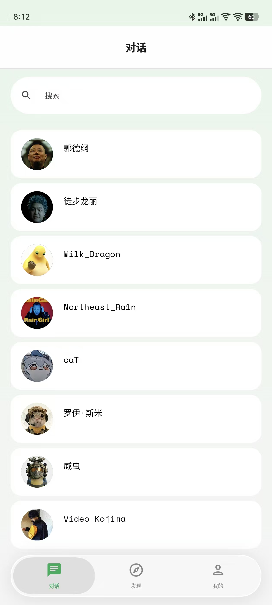
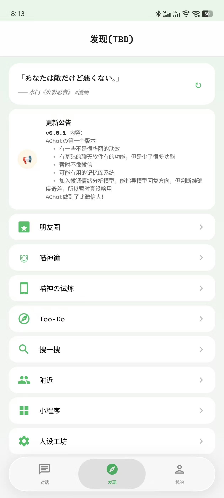
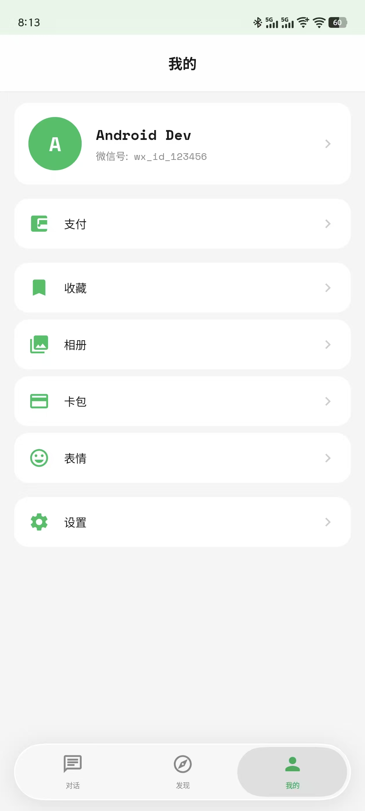

<p align="center">
  
</p>
<p align="center"><strong>Wisp (原AChat)</strong><br/>一个 AI 聊天应用</p>

> 代码由 AI 生成，功能设计参考了类似项目。

> 代码可读性一般，欢迎指指点点。

一个 Android 端的 AI 聊天应用。支持情绪感知、好感度系统、RAG 记忆、主动关怀等功能。

## 截图

<p align="center">
  
  
  
</p>

## 功能

- **情绪感知** — 本地 7 类情绪模型检测用户对话情绪
- **好感度系统** — 7 级关系，好感度影响 AI 回复
- **主动关怀** — AI 闲时主动问候，支持多种触发条件
- **情绪可视化** — 用户消息旁显示情绪表情
- **时间感知** — 联网校准
- **导入 Skill** — 支持 ex-skill 格式导入角色人设，未来支持酒馆角色卡
- **语音输入 (STT)** — 6 引擎可选 + 自动降级链，详见下方 [STT](#语音输入-stt)
- **语音朗读 (TTS)** — 本地 / 云端 / PC GPT-SoVITS 三引擎降级链

## 语音输入 (STT)

设置 → 调试 → 语音转文字 (STT) 中选择引擎，主引擎失败时按降级链自动兜底：

| 引擎 | 适用场景 | 准确率 | 资源占用 |
|---|---|---|---|
| 本地 SenseVoice | 离线、中文为主 | 高（推荐） | 模型 239MB（int8） |
| 本地 Whisper | 离线、多语种 | 中（中文弱） | 模型 103MB（三件套） |
| 讯飞 RTASR | 在线、中文顶尖 | 极高 | 需 APPID + APIKey |
| 云端 Whisper | 在线、OpenAI 兼容 | 高 | 需 API Key |
| PC Whisper | 局域网 PC 转写 | 高 | 需 PC 服务 |
| 系统 STT | 兜底 | 取决于 ROM | 无 |

降级链示例：`local_sensevoice → xfyun → cloud → system`

### 本地 SenseVoice / Whisper 模型来源

通过 SAF（系统文件选择器）导入到 app 私有目录：

- **SenseVoice**：[sherpa-onnx-sense-voice-zh-en-ja-ko-yue-2024-07-17](https://github.com/k2-fsa/sherpa-onnx/releases/download/asr-models/sherpa-onnx-sense-voice-zh-en-ja-ko-yue-2024-07-17.tar.bz2)（解压后选 `model.int8.onnx` + `tokens.txt`）
- **Whisper**：[sherpa-onnx-whisper-tiny](https://github.com/k2-fsa/sherpa-onnx/releases/download/asr-models/sherpa-onnx-whisper-tiny.tar.bz2)（解压后选 `tiny-encoder.int8.onnx` + `tiny-decoder.int8.onnx` + `tiny-tokens.txt`）

## 开发者构建

依赖 [sherpa-onnx](https://github.com/k2-fsa/sherpa-onnx) 预编译 AAR 做 STT 推理。首次构建前需手动下载放置：

```bash
curl -L -o app/libs/sherpa-onnx-1.12.40.aar \
  https://github.com/k2-fsa/sherpa-onnx/releases/download/v1.12.40/sherpa-onnx-1.12.40.aar
```

AAR 体积 54MB，已通过 `.gitignore` 排除，不会进入版本库。

## 注意

Wisp 使用了 kyant0 的 AndroidLiquidGlass 库，建议使用 **Android 12 以上**。

## 我要玩！

### 1. 下载

从 Releases 页面下载最新 APK。

### 2. 配置 API

进入设置 → AI 接口，填写以下信息：

| 字段 |  |
|---|---|
| API 地址 | `https://api.cat.com/v1` |
| API Key | 你的 API 密钥 |
| 模型名 | 名字 |

DeepSeek API 可在 [这里](https://platform.deepseek.com) 获取。

ChatGPT API 在 [那里](https://platform.openai.com/api-keys)。

Claude API 在 [哪里](https://console.anthropic.com/)。


### 3. 开始聊天

创建一个对话角色，即可开始聊天。

## 许可证

基于 Apache-2.0 开源：
- ✅ 你可以自由使用、修改、分发
- ✅ 可以用于个人或商业项目
- ✅ 修改后可以闭源发布
- ❗ 需保留原始版权声明和免责声明

## 致谢

- [Reasonix](https://github.com/esengine/deepseek-reasonix) — 给我省了很多钱 :)
- [EmotionTalk](https://github.com/NKU-HLT/EmotionTalk) — 情绪模型训练数据
- [ex-skill](https://github.com/perkfly/ex-skill) — 角色导入格式参考
- [LingChat](https://github.com/SlimeBoyOwO/LingChat) — 设计思路参考
- [Operit](https://github.com/AAswordman/Operit) — 架构与功能参考
- [SillyTavern](https://github.com/SillyTavern/SillyTavern) — 角色卡/世界书功能参考
- [LiquidGlass](https://github.com/Kyant0/AndroidLiquidGlass) — 液态玻璃效果
